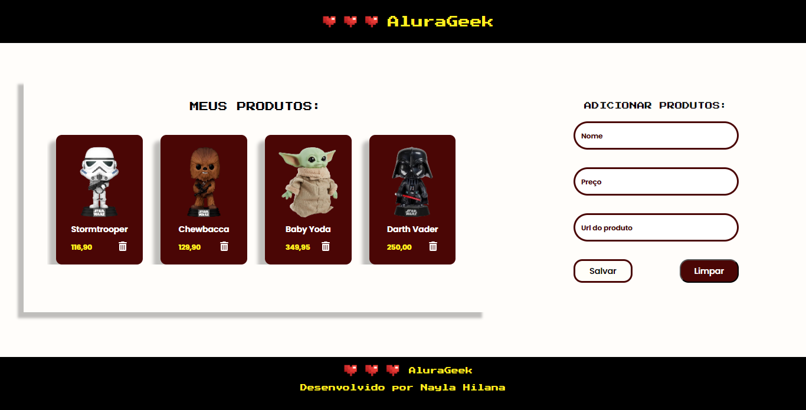

<h1 align="center">Challenge Alura Geek</h1>

##

O AluraGeek é um catálogo de produtos geek, o catálogo exibe produtos previamente cadastrados e também permite que o usuário cadastre os próprios produtos de maneira simples.

_O que foi implementado no projeto:_

- Simulador de `API` de produtos com `JSON`.
- Formulário para adicionar produtos.

⚙️ Tecnologias utilizadas:

#

🔗 O projeto pode ser acessado aqui: https://alurageek-hilana.netlify.app/
